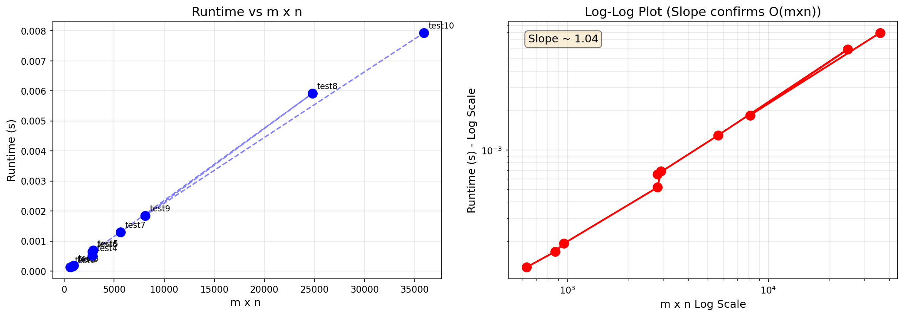

# COP4533 Assignment 3

**Name:** Yash Narayan
**UFID:** 31198967


## Problem Description

You are given two strings A and B over a fixed alphabet. Each character in the alphabet has a nonnegative integer value. Your task is to compute a common subsequence of A and B that maximizes the total value, and to output both this maximum value and the corresponding subsequence itself

If a sequence C = $c_1c_2 . . . c_k$ is chosen, then its value is Val(C) = $\sum_{i=1}^{k} v(c_i)$ where $v(c_i)$ is the value assigned to character $c_i$. Your program must output both Val(C)
and one optimal subsequence C.

## Dependencies

- Python 3.12 or later


## Running the Program

```bash
python main.py < examples/input.txt
```

**Input format:**
```
K
c1 v1
c2 v2
...
cK vK
stringA
stringB
```

**Example input:**
```
3
a 2
b 4
c 5
aacb
caab
```

**Expected output:**
```
9
cb
```

Verification: Val(cb) = 5 + 4 = 9.


## Repository Structure
```
.
├── main.py                           
├── runtime_graph.png    
├── README.md
├── examples/
│   ├── input.txt        
│   └── output.txt       
└── tests/
    ├── test1.txt
    ├── test2.txt
    └── ...
                  
```


## Question 1: Runtime Comparison

The algorithm was timed on 10 samples, with string lengths ranging from 25 to 203 characters. 

| Test   | m | n | mxn    | Time (s)  |
|--------|--------|--------|--------|-----------|
| test1  | 25     | 25     | 625    | 0.000142  |
| test2  | 30     | 29     | 870    | 0.000198  |
| test3  | 32     | 30     | 960    | 0.000218  |
| test4  | 53     | 53     | 2,809  | 0.000847  |
| test5  | 55     | 53     | 2,915  | 0.000803  |
| test6  | 53     | 53     | 2,809  | 0.000775  |
| test7  | 75     | 75     | 5,625  | 0.001286  |
| test8  | 160    | 155    | 24,800 | 0.005583  |
| test9  | 90     | 90     | 8,100  | 0.002314  |
| test10 | 177    | 203    | 35,931 | 0.008554  |

As m x n increases from 625 to 35,931 (~57.5x), runtime increases from 0.000142s to 0.008554s (~60x). This is consistent with O(mxn) behavior: the algorithm fills one cell per loop iteration across the full mxn table.

To re-create the graph:
```bash
python graph.py
```



---

## Question 2: Recurrence

Let dp[i][j] denote the maximum value of a common subsequence of A[1..i] and B[1..j].

Base cases:
- dp[0][j] = [0 for all j]
- dp[i][0] = [0 for all i]

Recurrence:
- if A[i-1] == B[j-1]:    dp[i][j] = dp[i-1][j-1] + weight[A[i-1]]
- else:    dp[i][j] = max(dp[i-1][j], dp[i][j-1])

Correctness argument:

Consider any optimal common subsequence of A[1..i] and B[1..j]. There are three cases:

1. A[i] == B[j] and both are included. The remaining subsequence is an optimal solution over A[1..i-1] and B[1..j-1], so dp[i][j] = dp[i-1][j-1] + weight[A[i]].
2. A[i] is not in the subsequence. The solution is identical to the optimal over A[1..i-1] and B[1..j].
3. B[j] is not in the subsequence. The solution is identical to the optimal over A[1..i] and B[1..j-1].

The recurrence takes the maximum across applicable cases, so it captures all possibilities. The base cases handles empty strings, where the value is 0.

---

## Question 3: Algorithm and Runtime

**Pseudocode:**
```python
def HVLCS(A, B, weights):
    m, n = len(A), len(B)
    dp = [[0] * (n + 1) for _ in range(m + 1)]

    for i in range(1, m + 1):
        for j in range(1, n + 1):
            if A[i-1] == B[j-1]:
                dp[i][j] = dp[i-1][j-1] + weights[A[i-1]]
            else:
                dp[i][j] = max(dp[i-1][j], dp[i][j-1])

    return dp[m][n]
```

**Time complexity:** O(m x n). The algorithm iterates over all elements in an (m+1) x (n+1) table, with O(1) work/ array valeue

**Space complexity:** O(m x n) for the DP table.


## Running All Tests
```bash
for i in {1..10}; do python main.py < tests/test$i.txt; done
```

Or run the graph script, which times all test files:
```bash
python graph.py
```
